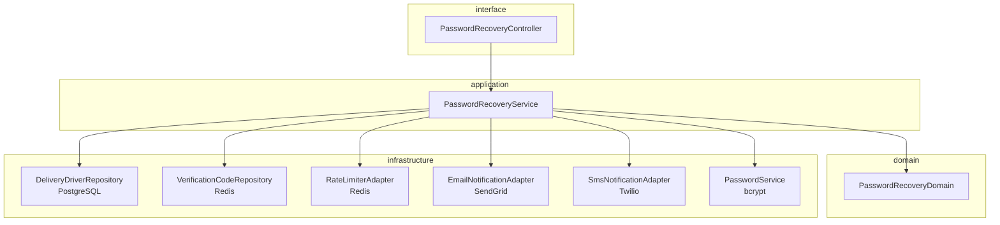
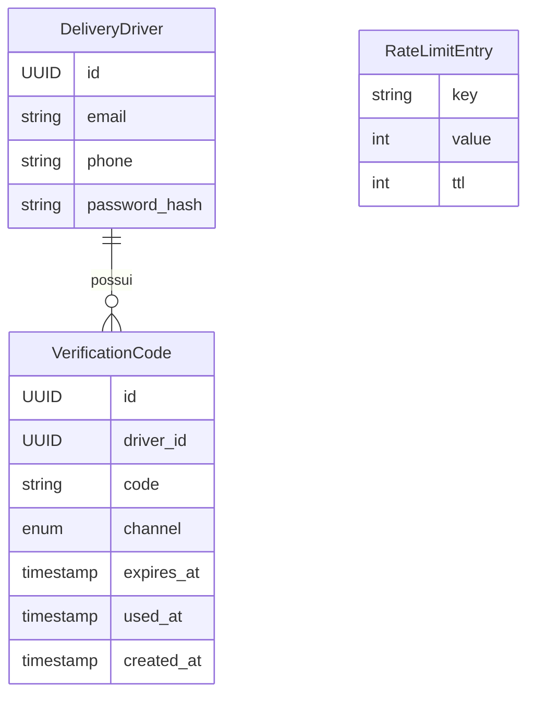
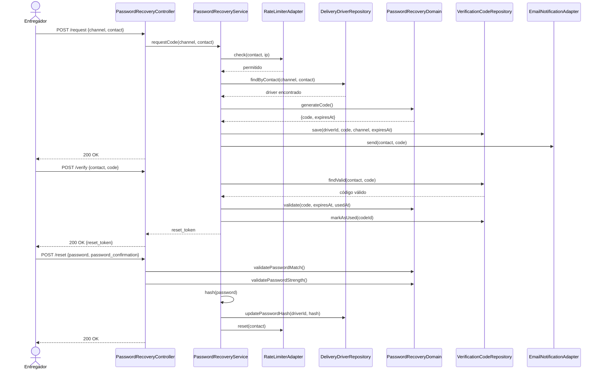

# Exemplo de Design Técnico — Recuperação de Senha

> **Nota:** Este é um exemplo anotado. Os comentários entre `<!-- -->` explicam por que cada
> parte satisfaz o checklist da skill `design-standards`. Remova-os em designs reais.
> Os artefatos de origem são: `prd.md`, `stories.md`, `scenarios.feature`,
> `requirements.md` e `nf-requirements.md` da feature `recuperacao-de-senha`.

---

## Visão Geral Técnica

<!-- ✅ Descreve a abordagem técnica (OTP numérico + expiração), não o que o usuário faz -->
<!-- ✅ Menciona tecnologias-chave: OTP, bcrypt, Redis, adaptadores de email/SMS -->
<!-- ✅ Referencia o padrão arquitetural (hexagonal) -->
<!-- ✅ Consistente com constitution.md (serviços externos isolados em adapters) -->
<!-- ✅ 3 frases — dentro do limite de 4 -->

A recuperação de senha usa um código OTP numérico de uso único com expiração de 5 minutos,
entregue pelo canal escolhido pelo entregador (email ou SMS) via adaptadores de infraestrutura
isolados. O controle de tentativas excessivas é implementado com rate limiting baseado em Redis,
persistindo contadores por contato e por IP com TTL de 30 minutos. A atualização de senha aplica
bcrypt com custo mínimo de 100ms, e a resposta neutra de confirmação é retornada independentemente
de o contato estar cadastrado, conforme NFR-3.

---

## Arquitetura de Componentes

<!-- ✅ Diagrama flowchart TD mostrando dependências entre todas as camadas -->
<!-- ✅ Cada componente tem camada e responsabilidade única -->
<!-- ✅ Dependências apontam para dentro (infra → application → domain) -->
<!-- ✅ Serviços externos (email, SMS) isolados em adapters de infraestrutura -->
<!-- ✅ Todos os REQs são endereçados por ao menos um componente -->



### PasswordRecoveryController
- **Camada:** interface
- **Responsabilidade:** Receber requisições HTTP, validar formato do payload e delegar para PasswordRecoveryService
- **Depende de:** PasswordRecoveryService

### PasswordRecoveryService
- **Camada:** application
- **Responsabilidade:** Orquestrar o fluxo de recuperação: verificar rate limit, buscar conta, gerar/validar OTP, atualizar senha
- **Depende de:** DeliveryDriverRepository (port), VerificationCodeRepository (port), NotificationPort (port), PasswordService (port), RateLimiterPort (port)

### PasswordRecoveryDomain
- **Camada:** domain
- **Responsabilidade:** Encapsular as regras de negócio: validade do código OTP, requisitos mínimos de senha, regra de uso único
- **Depende de:** — (sem dependências externas)

### DeliveryDriverRepository
- **Camada:** infrastructure
- **Responsabilidade:** Buscar entregador por email ou telefone e atualizar o hash de senha
- **Depende de:** PostgreSQL (Prisma)

### VerificationCodeRepository
- **Camada:** infrastructure
- **Responsabilidade:** Persistir, recuperar e invalidar códigos OTP com TTL de 5 minutos
- **Depende de:** Redis

### RateLimiterAdapter
- **Camada:** infrastructure
- **Responsabilidade:** Controlar e persistir contadores de tentativas por contato e por IP com TTL de 30 minutos
- **Depende de:** Redis

### EmailNotificationAdapter
- **Camada:** infrastructure
- **Responsabilidade:** Enviar o código OTP por email via serviço externo de email
- **Depende de:** Serviço externo de email (ex: SendGrid) ← *novo — requer configuração*

### SmsNotificationAdapter
- **Camada:** infrastructure
- **Responsabilidade:** Enviar o código OTP por SMS via serviço externo de SMS
- **Depende de:** Serviço externo de SMS (ex: Twilio) ← *novo — requer configuração*

### PasswordService
- **Camada:** infrastructure
- **Responsabilidade:** Gerar hash de senha com bcrypt (custo mínimo de 100ms) e comparar plain-text com hash
- **Depende de:** bcrypt

---

## Modelo de Dados

<!-- ✅ Diagrama erDiagram mostrando todas as entidades e relações -->
<!-- ✅ Entidades derivadas dos requisitos e cenários BDD, não inventadas -->
<!-- ✅ Cada campo tem tipo e descrição -->
<!-- ✅ TTL de expiração presente (NFR-2: invalidar após 5 minutos) -->
<!-- ✅ Campo `used_at` para garantir uso único (REQ-10) -->
<!-- ✅ Nenhum DDL ou detalhe de migração -->



### VerificationCode
| Campo | Tipo | Descrição |
|-------|------|-----------|
| id | UUID | Identificador único |
| driver_id | UUID | Referência ao entregador dono do código |
| code | string | Código OTP numérico (6 dígitos) |
| channel | enum | `email` \| `sms` — canal pelo qual foi enviado |
| expires_at | timestamp | Momento de expiração (geração + 5 minutos) |
| used_at | timestamp \| null | Preenchido no momento do uso bem-sucedido; null se ainda não usado |
| created_at | timestamp | Data de geração |

**Relações:** N:1 com `DeliveryDriver` via `driver_id`. Um entregador pode ter múltiplos códigos (tentativas anteriores), mas apenas o mais recente não expirado é válido.

### RateLimitEntry (Redis)
| Campo | Tipo | Descrição |
|-------|------|-----------|
| key | string | `rate_limit:contact:<hash_do_contato>` ou `rate_limit:ip:<ip>` |
| value | int | Contador de tentativas consecutivas sem sucesso |
| ttl | int | 30 minutos em segundos; reiniciado ao zerar o contador |

**Relações:** Nenhuma relação com entidades relacionais — estrutura exclusivamente em Redis.

> **Nota:** O `DeliveryDriver` já existe via feature `register-user`. Esta feature não altera
> sua estrutura — apenas lê email/telefone e atualiza `password_hash`.

---

## API / Contratos

<!-- ✅ Endpoints derivados dos cenários BDD -->
<!-- ✅ Payloads com campos e tipos -->
<!-- ✅ Todos os erros dos cenários BDD têm código HTTP correspondente -->
<!-- ✅ Resposta neutra explícita (NFR-3) no endpoint de solicitação -->
<!-- ✅ Código 429 para bloqueio por tentativas (NFR-4) -->
<!-- ✅ Autenticação declarada em todos os endpoints (públicos) -->

### POST /api/v1/password-recovery/request
- **Autenticação:** pública
- **Descrição:** Solicita o envio de código OTP. Retorna mensagem neutra independentemente de o contato existir (NFR-3).
- **Request body:**
  ```json
  {
    "channel": "email | sms",
    "contact": "string"
  }
  ```
- **Response 200** (sempre retornado, cadastrado ou não — NFR-3):
  ```json
  {
    "message": "Se este dado estiver cadastrado, você receberá um código em instantes."
  }
  ```
- **Erros:**
  | Código | Condição |
  |--------|----------|
  | 400 | Payload inválido: `channel` ausente, `contact` vazio ou com formato inválido para o canal (REQ-5) |
  | 429 | Rate limit atingido: 5 tentativas consecutivas do mesmo contato ou IP (NFR-4, REQ-11) |

---

### POST /api/v1/password-recovery/verify
- **Autenticação:** pública
- **Descrição:** Valida o código OTP informado pelo entregador.
- **Request body:**
  ```json
  {
    "contact": "string",
    "code": "string"
  }
  ```
- **Response 200:**
  ```json
  {
    "reset_token": "string (token de curta duração para autorizar o reset)"
  }
  ```
- **Erros:**
  | Código | Condição |
  |--------|----------|
  | 400 | Payload inválido |
  | 401 | Código inválido, expirado ou já utilizado (REQ-9, NFR-2) |

---

### POST /api/v1/password-recovery/reset
- **Autenticação:** `reset_token` no header (emitido pelo endpoint `/verify`)
- **Descrição:** Atualiza a senha da conta após validação do OTP.
- **Request body:**
  ```json
  {
    "password": "string",
    "password_confirmation": "string"
  }
  ```
- **Response 200:**
  ```json
  {
    "message": "Senha atualizada com sucesso."
  }
  ```
- **Erros:**
  | Código | Condição |
  |--------|----------|
  | 400 | `password` e `password_confirmation` divergentes (REQ-7) |
  | 422 | `password` não atende requisitos mínimos: 8+ caracteres, maiúsculas, minúsculas, números, especiais (REQ-8) |
  | 401 | `reset_token` inválido ou expirado |

---

## Fluxo de Execução

<!-- ✅ Um fluxo para cada Scenario do arquivo .feature -->
<!-- ✅ Caminho feliz descrito passo a passo com componente responsável em cada passo -->
<!-- ✅ Todos os fluxos alternativos dos cenários BDD cobertos -->
<!-- ✅ Invalidação imediata após uso explícita (REQ-10) -->
<!-- ✅ Resposta neutra para contato não cadastrado explícita (NFR-3) -->

### Fluxo: Recuperação de senha com email e código válido (caminho feliz)
1. **PasswordRecoveryController** recebe `POST /request` e valida o formato do payload (channel + contact)
2. **PasswordRecoveryController** chama `PasswordRecoveryService.requestCode(channel, contact)`
3. **PasswordRecoveryService** chama `RateLimiterAdapter.check(contact, ip)` — verifica se não está bloqueado
4. **PasswordRecoveryService** chama `DeliveryDriverRepository.findByContact(channel, contact)`
5. Se o contato **não estiver cadastrado**: **PasswordRecoveryService** retorna resposta neutra sem gerar código (NFR-3) — fluxo encerra no passo 9
6. **PasswordRecoveryService** chama `PasswordRecoveryDomain.generateCode()` — gera OTP de 6 dígitos
7. **PasswordRecoveryService** chama `VerificationCodeRepository.save(driverId, code, channel, expiresAt)` — TTL: 5 minutos
8. **PasswordRecoveryService** chama `EmailNotificationAdapter.send(contact, code)` (ou `SmsNotificationAdapter` se channel = sms)
9. **PasswordRecoveryController** retorna `200 OK` com mensagem neutra
10. **PasswordRecoveryController** recebe `POST /verify` com contact + code
11. **PasswordRecoveryService** chama `VerificationCodeRepository.findValid(contact, code)` — busca código não expirado e não usado
12. **PasswordRecoveryDomain** valida: código existe, `expires_at > now()`, `used_at` é null
13. **PasswordRecoveryService** chama `VerificationCodeRepository.markAsUsed(codeId)` — invalida imediatamente (REQ-10)
14. **PasswordRecoveryService** emite `reset_token` de curta duração (15 minutos)
15. **PasswordRecoveryController** retorna `200 OK` com `{ reset_token }`
16. **PasswordRecoveryController** recebe `POST /reset` com password + password_confirmation + reset_token
17. **PasswordRecoveryDomain** valida: campos iguais (REQ-7), senha atende requisitos mínimos (REQ-8)
18. **PasswordService** gera hash bcrypt com custo ajustado para ≥ 100ms (NFR-5)
19. **DeliveryDriverRepository** atualiza `password_hash` do entregador
20. **RateLimiterAdapter** reinicia o contador do contato (NFR-4 — sucesso zera o bloqueio)
21. **PasswordRecoveryController** retorna `200 OK` com mensagem de sucesso



**Fluxos alternativos:**

- *Solicitação com formato inválido (Scenario: "dado de formato inválido")*: passo 1 falha na validação → Controller retorna `400` com mensagem de formato inválido (REQ-5)
- *Contato não cadastrado (Scenario: "dado não cadastrado")*: passo 5 — Service retorna resposta neutra idêntica ao sucesso, sem gerar código (NFR-3, REQ-6)
- *Código inválido ou expirado (Scenario: "código expirado ou inválido")*: passo 11 — `findValid` retorna null → Service lança erro → Controller retorna `401` (REQ-9)
- *Reutilização de código (Scenario: "reutilizar código após uso")*: passo 12 — `used_at` não é null → Domain rejeita → Controller retorna `401` (REQ-10)
- *Senhas divergentes (Scenario: "campos de confirmação divergentes")*: passo 17 falha → Controller retorna `400` (REQ-7)
- *Senha fraca (Scenario: "sem atender requisitos mínimos")*: passo 17 falha com lista de requisitos → Controller retorna `422` (REQ-8)
- *Bloqueio por tentativas (Scenario: "bloqueio por tentativas excessivas")*: passo 3 detecta 5 tentativas → Service retorna bloqueio → Controller retorna `429` (NFR-4, REQ-11, REQ-12)

---

## Decisões Técnicas

<!-- ✅ Apenas decisões com trade-off real -->
<!-- ✅ Cada decisão tem ao menos duas alternativas -->
<!-- ✅ Justificativas mencionam o trade-off explicitamente -->
<!-- ✅ Cada decisão rastreada a um requisito -->

### DT-1: OTP numérico vs. link mágico
- **Problema:** Como implementar o mecanismo de verificação de identidade para permitir o reset de senha
- **Alternativas consideradas:** (a) código OTP numérico de 6 dígitos, (b) link mágico enviado por email, (c) pergunta de segurança
- **Decisão:** Código OTP numérico de 6 dígitos
- **Justificativa:** OTP funciona para ambos os canais (email e SMS), enquanto link mágico é inviável por SMS. Trade-off: OTP é ligeiramente mais suscetível a brute force em janelas longas — mitigado pelo TTL de 5 minutos (NFR-2) e rate limiting (NFR-4).
- **Requisito relacionado:** REQ-1, NFR-2

### DT-2: Armazenamento do código OTP
- **Problema:** Onde persistir o código OTP para permitir validação e invalidação após uso
- **Alternativas consideradas:** (a) banco relacional (tabela `verification_codes`), (b) Redis com TTL nativo
- **Decisão:** Banco relacional (tabela `verification_codes`)
- **Justificativa:** Permite rastreabilidade em logs (NFR-6 exige retenção por 1 ano), histórico de tentativas e auditoria. Redis com TTL nativo eliminaria os dados automaticamente, impossibilitando a retenção exigida. Trade-off: operações de leitura/escrita são ligeiramente mais lentas que Redis, mas dentro do SLA de 30 segundos (NFR-1).
- **Requisito relacionado:** NFR-6, REQ-10

### DT-3: Rate limiting — armazenamento dos contadores
- **Problema:** Onde persistir contadores de tentativas para rate limiting por contato e por IP
- **Alternativas consideradas:** (a) banco relacional, (b) Redis com TTL nativo
- **Decisão:** Redis com TTL de 30 minutos
- **Justificativa:** Contadores de rate limit são efêmeros por natureza (TTL = período de bloqueio) e requerem alta frequência de leitura/escrita com baixa latência. Redis com TTL nativo elimina jobs de limpeza. Trade-off: se Redis cair, contadores são perdidos e o bloqueio é temporariamente ineficaz — aceitável dado que o banco relacional ainda persiste os logs (NFR-6).
- **Requisito relacionado:** NFR-4, REQ-11, REQ-12

### DT-4: Reset token após validação do OTP
- **Problema:** Como autorizar o endpoint `/reset` após a validação bem-sucedida do código OTP sem expor o OTP no terceiro passo
- **Alternativas consideradas:** (a) reutilizar o código OTP como token de autorização, (b) emitir JWT de curta duração após validação
- **Decisão:** JWT de curta duração (15 minutos) emitido no endpoint `/verify`
- **Justificativa:** Isola o código OTP (revogado após uso em REQ-10) do mecanismo de autorização do reset. JWT com TTL curto limita a janela de exposição. Trade-off: adiciona um token extra ao fluxo — aceitável dado o ganho de segurança.
- **Requisito relacionado:** REQ-2, REQ-10