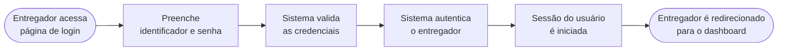
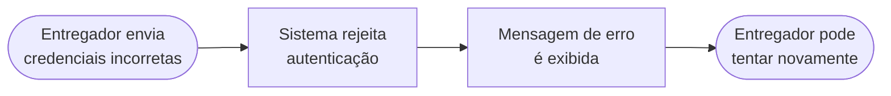

IMPORTANT:

This PRD must describe **product behavior only**.

Do NOT include:

- libraries
- frameworks
- database schemas
- authentication mechanisms
- API routes
- infrastructure

These belong to the design phase.

# Exemplo Anotado de PRD — Login de Entregador

> Este é um exemplo de PRD de alta qualidade para a feature `login-entregador`.
> Ele serve como referência para avaliar e refinar especificações iniciais
> antes da geração de requisitos formais (EARS), cenários BDD, design e tasks.

---

# PRD — Login de Entregador

## Visão Geral

Permitir que um entregador previamente cadastrado acesse a plataforma de delivery
autenticando-se com suas credenciais e iniciando uma sessão válida no sistema.

Após autenticação bem-sucedida, o entregador poderá acessar funcionalidades
restritas da plataforma sem precisar autenticar-se novamente a cada requisição.

---

## Problema

Entregadores cadastrados atualmente não possuem um mecanismo formal
de autenticação na plataforma.

Sem autenticação, funcionalidades restritas não podem ser protegidas
adequadamente e o sistema não consegue garantir que apenas usuários
autorizados executem determinadas ações.

Além disso, a ausência de sessões persistentes prejudica a experiência
do entregador durante o uso contínuo do sistema.

---

## Usuário-Alvo

Entregador com conta previamente criada via a feature `register-user`.

---

## Objetivos

1. Permitir que um entregador se autentique utilizando seu identificador e senha.
2. Criar uma sessão autenticada válida após a verificação das credenciais.
3. Permitir que o sistema identifique automaticamente o tipo de identificador informado.
4. Rejeitar tentativas de autenticação com credenciais inválidas.
5. Manter a sessão do usuário ativa durante o uso normal da aplicação.

---

## Critérios de Sucesso

| Critério                                                | Medida                                           |
| ------------------------------------------------------- | ------------------------------------------------ |
| Entregador consegue acessar o sistema após login válido | 100% dos logins válidos resultam em sessão ativa |
| Credenciais inválidas são rejeitadas                    | Sistema retorna erro de autenticação             |
| Sessão permite acesso a funcionalidades protegidas      | Usuário autenticado acessa dashboard             |
| Sessão permanece ativa durante uso normal               | Usuário não precisa autenticar repetidamente     |
| Tentativas abusivas de login são tratadas pelo sistema  | Mecanismos de proteção ativados                  |

---

## Fora do Escopo

- Recuperação de senha
- Verificação de email ou telefone
- Login social
- Logout explícito
- Autenticação multifator
- Controle de múltiplas sessões simultâneas

---

## Fluxo Principal

---

## Fluxos Alternativos

### Credenciais inválidas

---

## Dependências

- Feature `register-user` responsável pela criação da conta do entregador
- Interface de login no frontend

---

## Riscos

| Risco                                                   | Mitigação                                                |
| ------------------------------------------------------- | -------------------------------------------------------- |
| Tentativas repetidas de login com credenciais inválidas | Aplicar mecanismos de proteção contra abuso              |
| Usuários não autorizados tentando acessar o sistema     | Exigir autenticação antes de acessar recursos protegidos |
| Sessões inválidas permitindo acesso indevido            | Validar sessão a cada acesso protegido                   |

---

## Observações

Este documento descreve **apenas o comportamento esperado da feature**.

Detalhes técnicos como:

- formato de tokens
- mecanismos de sessão
- bibliotecas utilizadas
- estratégias de armazenamento

devem ser definidos posteriormente na etapa de **Design Técnico**.
