# Exemplo de Tasks — Recuperação de Senha

> **Nota:** Exemplo anotado. Os comentários `<!-- -->` explicam por que cada parte
> satisfaz o checklist. Remova-os em tasks reais.
>
> Os artefatos de origem são os da feature `recuperacao-de-senha`:
> `requirements.md`, `nf-requirements.md`, `scenarios.feature` e `design.md`.

---

## REQ-1 — Envio de código de verificação

> When a registered delivery driver submits a valid contact detail and requests a verification code, the system shall send a verification code to the chosen contact channel.

<!-- ✅ Bloco próprio para REQ-1 -->
<!-- ✅ Texto completo do requisito copiado do requirements.md -->
<!-- ✅ Uma task por entidade nova, por migration, por método, por endpoint e por Scenario -->
<!-- ✅ NFR-1 (performance de entrega) agrupado aqui pois seu campo Fonte aponta para REQ-1 -->

### T-01: Criar entidade `VerificationCode`

- [ ] Definir a entidade `VerificationCode` no ORM com os campos: `id` (UUID), `driver_id` (UUID, FK), `code` (string, 6 dígitos), `channel` (enum: email|sms), `expires_at` (timestamp), `used_at` (timestamp nullable), `created_at` (timestamp).

**Rastreabilidade:** REQ-1 · REQ-9 · REQ-10 · NFR-2
**Depende de:** —
**Concluída quando:** A entidade está definida no ORM com todos os campos, tipos e a FK para `delivery_drivers` corretamente configurados.

---

### T-02: Criar migration da tabela `verification_codes`

- [ ] Criar a migration que cria a tabela `verification_codes` com FK para `delivery_drivers` e constraint NOT NULL nos campos obrigatórios.

**Rastreabilidade:** REQ-1 · REQ-10
**Depende de:** T-01
**Concluída quando:** A migration executa sem erros em desenvolvimento e a tabela existe no banco com a estrutura correta.

---

### T-03: Implementar `PasswordRecoveryDomain.generateCode()`

- [ ] Implementar o método que gera um código OTP numérico aleatório de 6 dígitos e calcula o timestamp de expiração como `now() + 5 minutos`.

**Rastreabilidade:** REQ-1 · NFR-2 · DT-1
**Depende de:** —
**Concluída quando:** O método gera códigos de exatamente 6 dígitos numéricos e o `expires_at` retornado é sempre `now() + 5min`.

---

### T-04: Implementar `VerificationCodeRepository.save()`

- [ ] Implementar o método `save(driverId, code, channel, expiresAt)` que persiste um novo registro de `VerificationCode` no banco.

**Rastreabilidade:** REQ-1
**Depende de:** T-01 · T-02
**Concluída quando:** O método persiste o registro com todos os campos e o registro é recuperável por `driverId`.

---

### T-05: Implementar `DeliveryDriverRepository.findByContact()`

- [ ] Implementar o método `findByContact(channel, contact)` que busca um entregador pelo email ou telefone informado. Deve retornar `null` (sem lançar erro) quando o contato não for encontrado.

**Rastreabilidade:** REQ-1 · REQ-6 · NFR-3
**Depende de:** —
**Concluída quando:** O método retorna a entidade do entregador quando o contato existe e retorna `null` silenciosamente quando não existe.

---

### T-06: Implementar `EmailNotificationAdapter.send()`

- [ ] Implementar o adapter que envia o código OTP por email via o serviço externo de email configurado no projeto.

**Rastreabilidade:** REQ-1 · NFR-1 · Scenario: "Recuperação de senha com email e código válido"
**Depende de:** —
**Concluída quando:** O adapter envia o email com o código OTP e o email é recebível no ambiente de teste.

---

### T-07: Implementar `SmsNotificationAdapter.send()`

- [ ] Implementar o adapter que envia o código OTP por SMS via o serviço externo de SMS configurado no projeto.

**Rastreabilidade:** REQ-1 · NFR-1
**Depende de:** —
**Concluída quando:** O adapter envia a mensagem SMS com o código OTP e a mensagem é recebível no ambiente de teste.

---

### T-08: Criar schema de validação do payload de `POST /request`

- [ ] Criar schema de validação (ex: Zod) para o payload de solicitação: `channel` (enum: email|sms, obrigatório) e `contact` (string, obrigatório, formato validado conforme o canal — email ou telefone).

**Rastreabilidade:** REQ-1 · REQ-5
**Depende de:** —
**Concluída quando:** O schema rejeita `channel` ausente, `contact` vazio e `contact` com formato inválido para o canal informado.

---

### T-09: Implementar `POST /api/v1/password-recovery/request`

- [ ] Implementar o endpoint completo: validar payload com T-08, verificar rate limit, buscar entregador, gerar e persistir OTP se cadastrado, enviar pelo canal correspondente, retornar sempre a mensagem neutra de confirmação (200 OK) independentemente de o contato estar cadastrado.

**Rastreabilidade:** REQ-1 · REQ-6 · NFR-3 · Scenario: "Recuperação de senha com email e código válido" · Scenario: "Solicitação de código com dado não cadastrado"
**Depende de:** T-03 · T-04 · T-05 · T-06 · T-07 · T-08 · T-12 · T-21
**Concluída quando:** O endpoint retorna 200 com mensagem neutra tanto para contato cadastrado quanto para contato não cadastrado; envia o código apenas para contatos cadastrados.

---

### T-10: Cobrir Scenario "Recuperação de senha com email e código válido" (E2E)

- [ ] Implementar teste E2E que cobre o fluxo completo: solicitar código por email → validar código → redefinir senha → verificar redirecionamento para login.

**Rastreabilidade:** REQ-1 · REQ-2 · REQ-3 · REQ-4 · Scenario: "Recuperação de senha com email e código válido"
**Depende de:** T-09 · T-14 · T-19
**Concluída quando:** O teste passa em CI com banco e Redis reais (ou mocks de serviços externos configurados).

---

### ↳ NFR-1 — Entrega em até 30 segundos (p95)

<!-- ✅ NFR agrupado no bloco do REQ ao qual seu campo Fonte aponta (REQ-1) -->

### T-11: Teste de performance de entrega do código (NFR-1)

- [ ] Implementar teste que mede o tempo entre a chamada ao `POST /request` e a entrega efetiva do código no canal (email ou SMS), verificando que o p95 é ≤ 30 segundos em condições normais de operação.

**Rastreabilidade:** NFR-1 · REQ-1
**Depende de:** T-09
**Concluída quando:** O teste roda em CI e falha se o p95 de entrega exceder 30 segundos.

---

## REQ-2 — Avanço para redefinição após código válido

> When the delivery driver submits a valid and unexpired verification code, the system shall advance the driver to the password reset step.

<!-- ✅ Tasks granulares: método de domínio, método de repositório e endpoint separados -->
<!-- ✅ NFR-2 (expiração em 5 min) agrupado aqui pois Fonte aponta para REQ-9, mas REQ-2 é o contexto do fluxo positivo -->

### T-12: Implementar `PasswordRecoveryDomain.validateCode()`

- [ ] Implementar o método `validateCode(code, entry)` que verifica se o código existe, se `expires_at > now()` e se `used_at` é null. Retorna erro descritivo para cada condição de falha.

**Rastreabilidade:** REQ-2 · REQ-9 · REQ-10 · NFR-2 · Scenario: "Informar código de verificação expirado ou inválido" · Scenario: "Tentativa de reutilizar código após uso bem-sucedido"
**Depende de:** T-01
**Concluída quando:** O método aceita código válido, rejeita expirado e rejeita já utilizado, com erros distintos para cada caso.

---

### T-13: Implementar `VerificationCodeRepository.findValid()`

- [ ] Implementar o método `findValid(contact, code)` que busca um código não expirado e não utilizado para o contato informado. Retorna `null` se não encontrar.

**Rastreabilidade:** REQ-2 · REQ-9
**Depende de:** T-01 · T-02
**Concluída quando:** O método retorna o registro quando o código é válido e retorna `null` para código inválido, expirado ou já usado.

---

### T-14: Implementar `POST /api/v1/password-recovery/verify`

- [ ] Implementar o endpoint de validação de OTP: buscar o código com `findValid`, validar com `validateCode`, invalidar imediatamente com `markAsUsed` e emitir `reset_token` JWT de 15 minutos.

**Rastreabilidade:** REQ-2 · REQ-9 · REQ-10 · DT-4 · Scenario: "Informar código de verificação expirado ou inválido" · Scenario: "Tentativa de reutilizar código após uso bem-sucedido"
**Depende de:** T-12 · T-13 · T-15
**Concluída quando:** O endpoint retorna 200 com `reset_token` para código válido; retorna 401 para código inválido, expirado ou já utilizado.

---

## REQ-3 — Atualização da senha

> When the delivery driver submits a new password that meets the minimum security requirements and the confirmation field matches, the system shall update the account password.

### T-15: Implementar `VerificationCodeRepository.markAsUsed()`

- [ ] Implementar o método `markAsUsed(codeId)` que preenche o campo `used_at` com o timestamp atual, invalidando o código para uso futuro.

**Rastreabilidade:** REQ-3 · REQ-10 · NFR-2 · Scenario: "Tentativa de reutilizar código após uso bem-sucedido"
**Depende de:** T-01 · T-02
**Concluída quando:** Após a chamada, o campo `used_at` está preenchido e `findValid` retorna `null` para o mesmo código.

---

### T-16: Implementar `PasswordService.hash()`

- [ ] Implementar `PasswordService.hash(password)` com bcrypt usando fator de custo ajustado para garantir tempo mínimo de execução de 100ms por operação. Implementar também `PasswordService.compare(plain, hash)`.

**Rastreabilidade:** REQ-3 · NFR-5
**Depende de:** —
**Concluída quando:** `hash()` executa em ≥ 100ms medido por benchmark local; `compare()` retorna verdadeiro para a senha correta e falso para senha incorreta.

---

### T-17: Implementar `DeliveryDriverRepository.updatePasswordHash()`

- [ ] Implementar o método `updatePasswordHash(driverId, hash)` que atualiza o campo `password_hash` do entregador identificado pelo `driverId`.

**Rastreabilidade:** REQ-3
**Depende de:** —
**Concluída quando:** O método persiste o novo hash e o entregador consegue autenticar com a nova senha após a atualização.

---

### T-18: Criar schema de validação do payload de `POST /reset`

- [ ] Criar schema de validação para o payload de redefinição: campos `password` e `password_confirmation` (strings, obrigatórios). Validação de regras de segurança da senha fica no domínio — o schema valida apenas presença e tipo.

**Rastreabilidade:** REQ-3 · REQ-7 · REQ-8
**Depende de:** —
**Concluída quando:** O schema rejeita payloads com campos ausentes ou de tipo incorreto; aceita strings de qualquer conteúdo (a validação de força fica no domínio).

---

### T-19: Implementar `POST /api/v1/password-recovery/reset`

- [ ] Implementar o endpoint de redefinição: validar `reset_token` JWT, validar payload com T-18, executar validações de domínio (T-20, T-22), gerar hash bcrypt com T-16, atualizar senha com T-17 e reiniciar contador de rate limit.

**Rastreabilidade:** REQ-3 · REQ-7 · REQ-8 · Scenario: "Recuperação de senha com email e código válido" · Scenario: "Redefinição de senha com campos de confirmação divergentes" · Scenario: "Redefinição de senha sem atender aos requisitos mínimos"
**Depende de:** T-16 · T-17 · T-18 · T-20 · T-22
**Concluída quando:** O endpoint atualiza a senha para payload válido (200), rejeita senhas divergentes (400), rejeita senhas fracas com lista completa de requisitos (422) e rejeita `reset_token` inválido (401).

---

## REQ-4 — Redirecionamento para login

> When the account password is successfully updated, the system shall redirect the delivery driver to the login page.

<!-- ✅ REQ com task única — tudo que implementa este REQ é o comportamento do endpoint de reset -->
<!-- ✅ Task de teste agrupada no REQ mais próximo do Scenario (caminho feliz cobre REQ-4) -->

### T-20-a: Implementar redirecionamento para login no `POST /reset`

- [ ] Após atualização bem-sucedida da senha no endpoint `POST /reset`, retornar na resposta a URL de redirecionamento para a página de login da feature `login-entregador`.

**Rastreabilidade:** REQ-4 · Scenario: "Recuperação de senha com email e código válido"
**Depende de:** T-19
**Concluída quando:** A resposta 200 do `POST /reset` inclui o campo de redirecionamento apontando para a página de login correta.

---

## REQ-5 — Rejeição de formato inválido

> If the delivery driver submits a contact detail with an invalid format for the selected channel, the system shall reject the request and display an error message indicating the format is invalid.

### T-20: Implementar handler de erro 400 para formato inválido em `POST /request`

- [ ] Implementar o handler que retorna status 400 com mensagem de erro de formato quando o schema de validação de T-08 rejeita o payload por `contact` com formato inválido para o `channel` informado.

**Rastreabilidade:** REQ-5 · Scenario: "Solicitação de código com dado de formato inválido"
**Depende de:** T-08 · T-09
**Concluída quando:** O endpoint retorna 400 com mensagem descrevendo o erro de formato para email malformado e para telefone malformado.

---

### T-21: Cobrir Scenario "Solicitação com dado de formato inválido" (E2E)

- [ ] Implementar teste E2E verificando a rejeição de formatos inválidos de email e telefone.

**Rastreabilidade:** REQ-5 · Scenario: "Solicitação de código com dado de formato inválido"
**Depende de:** T-09
**Concluída quando:** O teste confirma status 400 e mensagem de erro de formato para email malformado e para número de telefone malformado.

---

## REQ-6 — Resposta neutra para contato não cadastrado

> If the submitted contact detail does not match any registered account, the system shall display the same neutral confirmation message shown when the contact detail is registered.

### T-22: Cobrir Scenario "Solicitação com dado não cadastrado" (E2E)

- [ ] Implementar teste E2E que verifica que a resposta para contato não cadastrado é textualmente idêntica à resposta para contato cadastrado (mesmo status 200, mesmo corpo), e que nenhum código é gerado ou enviado.

**Rastreabilidade:** REQ-6 · NFR-3 · Scenario: "Solicitação de código com dado não cadastrado"
**Depende de:** T-09
**Concluída quando:** O teste confirma que as respostas são idênticas nos campos visíveis ao cliente e que nenhum registro de `VerificationCode` é criado para o contato não cadastrado.

---

## REQ-7 — Rejeição de confirmação de senha divergente

> If the password field and the confirmation field do not match, the system shall reject the submission and display an error message indicating that the passwords do not match.

### T-23: Implementar `PasswordRecoveryDomain.validatePasswordMatch()`

- [ ] Implementar o método `validatePasswordMatch(password, confirmation)` que verifica se os dois campos são idênticos e retorna erro descritivo quando não são.

**Rastreabilidade:** REQ-7 · Scenario: "Redefinição de senha com campos de confirmação divergentes"
**Depende de:** —
**Concluída quando:** O método rejeita qualquer par de strings diferentes e aceita pares idênticos.

---

### T-24: Cobrir Scenario "Campos de confirmação divergentes" (E2E)

- [ ] Implementar teste E2E verificando a rejeição quando `password` e `password_confirmation` são diferentes.

**Rastreabilidade:** REQ-7 · Scenario: "Redefinição de senha com campos de confirmação divergentes"
**Depende de:** T-19
**Concluída quando:** O teste confirma status 400 e mensagem de erro indicando que os campos não coincidem.

---

## REQ-8 — Rejeição de senha que não atende requisitos mínimos

> If the new password does not meet the minimum security requirements — at least 8 characters including uppercase letters, lowercase letters, numbers, and special characters — the system shall reject the submission and display an error message listing all unmet requirements.

### T-25: Implementar `PasswordRecoveryDomain.validatePasswordStrength()`

- [ ] Implementar o método `validatePasswordStrength(password)` que verifica presença de ao menos 8 caracteres, letra maiúscula, letra minúscula, número e caractere especial. Retorna a lista completa de todos os requisitos violados, não apenas o primeiro.

**Rastreabilidade:** REQ-8 · Scenario: "Redefinição de senha sem atender aos requisitos mínimos"
**Depende de:** —
**Concluída quando:** O método retorna lista completa de violações em todos os casos; aceita senhas que atendem todos os critérios.

---

### T-26: Cobrir Scenario "Senha sem requisitos mínimos" (E2E)

- [ ] Implementar teste E2E verificando a rejeição de senhas fracas, cobrindo cada requisito mínimo isoladamente e verificando que a resposta lista todos os requisitos violados simultaneamente.

**Rastreabilidade:** REQ-8 · Scenario: "Redefinição de senha sem atender aos requisitos mínimos"
**Depende de:** T-19
**Concluída quando:** O teste confirma status 422 e que a lista de requisitos violados na resposta é completa (todos os ausentes, não apenas o primeiro).

---

## REQ-9 — Rejeição de código inválido ou expirado

> If the submitted verification code is invalid or expired, the system shall reject the code and display an error message indicating that the code is invalid or expired.

### T-27: Cobrir Scenario "Código expirado ou inválido" (E2E)

- [ ] Implementar teste E2E verificando a rejeição de código inválido e de código expirado (manipulando `expires_at` no banco de teste).

**Rastreabilidade:** REQ-9 · NFR-2 · Scenario: "Informar código de verificação expirado ou inválido"
**Depende de:** T-14
**Concluída quando:** O teste confirma status 401 para código com string inválida e para código com `expires_at` no passado.

---

### ↳ NFR-2 — Invalidação automática após 5 minutos

### T-28: Teste de expiração automática do código OTP (NFR-2)

- [ ] Implementar teste que verifica que um código gerado com `expires_at = now() - 1s` é rejeitado pelo endpoint `POST /verify` com status 401.

**Rastreabilidade:** NFR-2 · REQ-9
**Depende de:** T-14
**Concluída quando:** O teste confirma que o sistema rejeita códigos com timestamp de expiração no passado, sem necessidade de job de limpeza.

---

## REQ-10 — Invalidação imediata após uso bem-sucedido

> When a verification code is successfully used to complete the password recovery flow, the system shall immediately invalidate that code, preventing its reuse.

### T-29: Cobrir Scenario "Tentativa de reutilizar código" (E2E)

- [ ] Implementar teste E2E que verifica a rejeição de código já utilizado: concluir o fluxo de verificação uma vez com sucesso, tentar submeter o mesmo código novamente.

**Rastreabilidade:** REQ-10 · NFR-2 · Scenario: "Tentativa de reutilizar código após uso bem-sucedido"
**Depende de:** T-14
**Concluída quando:** O teste confirma status 401 na segunda submissão do mesmo código, imediatamente após a primeira ter tido sucesso.

---

## REQ-11 — Bloqueio após 5 tentativas sem sucesso

> If the delivery driver reaches 5 consecutive unsuccessful attempts to request a verification code, the system shall suspend the generation of new verification codes and display a message informing the driver that requests are suspended for 30 minutes.

### T-30: Implementar `RateLimiterAdapter.check()`

- [ ] Implementar o método `check(contact, ip)` que consulta o Redis e retorna se o contato ou IP está bloqueado (contador ≥ 5).

**Rastreabilidade:** REQ-11 · NFR-4 · DT-3
**Depende de:** —
**Concluída quando:** O método retorna `bloqueado: true` quando o contador no Redis for ≥ 5 e `bloqueado: false` caso contrário.

---

### T-31: Implementar `RateLimiterAdapter.increment()`

- [ ] Implementar o método `increment(contact, ip)` que incrementa o contador de tentativas no Redis para o contato e para o IP, com TTL de 30 minutos a partir do primeiro incremento.

**Rastreabilidade:** REQ-11 · NFR-4
**Depende de:** —
**Concluída quando:** O contador cresce corretamente para contato e IP independentemente, e expira automaticamente após 30 minutos sem ação manual.

---

### T-32: Implementar handler de erro 429 em `POST /request`

- [ ] Implementar o handler que retorna status 429 com mensagem informando que a solicitação está suspensa por 30 minutos quando `RateLimiterAdapter.check()` retornar bloqueado.

**Rastreabilidade:** REQ-11 · NFR-4 · Scenario: "Bloqueio por tentativas excessivas de solicitação de código"
**Depende de:** T-30 · T-31
**Concluída quando:** O endpoint retorna 429 com mensagem clara de suspensão na 5ª tentativa consecutiva sem sucesso.

---

### T-33: Cobrir Scenario "Bloqueio por tentativas excessivas" (E2E)

- [ ] Implementar teste E2E verificando o bloqueio após 5 tentativas: realizar 5 solicitações sem sucesso, verificar 429 na 6ª, manipular TTL do Redis no ambiente de teste e verificar desbloqueio automático.

**Rastreabilidade:** REQ-11 · REQ-12 · NFR-4 · Scenario: "Bloqueio por tentativas excessivas de solicitação de código"
**Depende de:** T-09
**Concluída quando:** O teste confirma 429 na 6ª tentativa e 200 após o período de bloqueio.

---

### ↳ NFR-4 — Bloqueio por contato e por IP, reinício após sucesso

### T-34: Implementar `RateLimiterAdapter.reset()`

- [ ] Implementar o método `reset(contact)` que zera o contador do contato no Redis após conclusão bem-sucedida do fluxo de recuperação.

**Rastreabilidade:** NFR-4 · REQ-11 · REQ-12
**Depende de:** —
**Concluída quando:** Após a chamada, o contador do contato no Redis é zerado e uma nova tentativa daquele contato não é bloqueada.

---

## REQ-12 — Desbloqueio automático após 30 minutos

> When the 30-minute lockout period has elapsed, the system shall automatically resume accepting verification code requests from the delivery driver.

<!-- ✅ REQ implementado via TTL do Redis — a task descreve a verificação, não há código adicional além do T-31 -->

### T-35: Teste de desbloqueio automático por TTL (NFR-4 / REQ-12)

- [ ] Implementar teste unitário que verifica que o TTL do Redis para as chaves de rate limiting é configurado corretamente como 30 minutos no momento do primeiro incremento, garantindo o desbloqueio automático sem job de limpeza.

**Rastreabilidade:** REQ-12 · NFR-4
**Depende de:** T-31
**Concluída quando:** O teste confirma que o TTL das chaves Redis criadas por `increment()` é de 1800 segundos (30 minutos).

---

## NFRs sem REQ direto

### ↳ NFR-3 — Resposta neutra independente de cadastro

<!-- NFR-3 não tem REQ direto no campo Fonte, mas é implementado por T-09 e testado por T-22 -->
<!-- Listado aqui apenas para rastreabilidade — as tasks estão nos blocos REQ-1 e REQ-6 -->

> Implementado em T-09 (endpoint) e testado em T-22 (E2E). Sem tasks adicionais necessárias.

---

### ↳ NFR-5 — Hash de senha com tempo mínimo de 100ms

### T-36: Teste de performance do `PasswordService.hash()` (NFR-5)

- [ ] Implementar teste que executa `PasswordService.hash()` 10 vezes e falha se qualquer execução for inferior a 100ms.

**Rastreabilidade:** NFR-5 · REQ-3
**Depende de:** T-16
**Concluída quando:** O teste roda em CI e falha se o tempo de qualquer execução de `hash()` for inferior a 100ms no hardware de CI.

---

### ↳ NFR-6 — Logging de tentativas com retenção de 1 ano

### T-37: Configurar logging de eventos de solicitação de código

- [ ] Configurar o registro em log de todos os eventos de `POST /request`: código enviado com sucesso, contato não cadastrado (sem revelar qual), formato inválido e bloqueio por rate limit. Logs devem incluir timestamp, tipo de evento, canal e hash do contato (sem PII em claro). Retenção mínima configurada: 1 ano.

**Rastreabilidade:** NFR-6 · REQ-11
**Depende de:** T-09
**Concluída quando:** Todos os eventos listados aparecem nos logs em ambiente de desenvolvimento e a política de retenção de 1 ano está configurada na infraestrutura de logs do projeto.

---

## Grafo de Dependências

```mermaid
flowchart TD
    T01["T-01: Criar entidade<br/>VerificationCode"]
    T02["T-02: Migration<br/>verification_codes"]
    T03["T-03: Domain.generateCode()"]
    T04["T-04: CodeRepo.save()"]
    T05["T-05: DriverRepo.findByContact()"]
    T06["T-06: EmailAdapter.send()"]
    T07["T-07: SmsAdapter.send()"]
    T08["T-08: Schema POST /request"]
    T09["T-09: POST /request endpoint"]
    T10["T-10: E2E caminho feliz"]
    T11["T-11: Perf NFR-1"]
    T12["T-12: Domain.validateCode()"]
    T13["T-13: CodeRepo.findValid()"]
    T14["T-14: POST /verify endpoint"]
    T15["T-15: CodeRepo.markAsUsed()"]
    T16["T-16: PasswordService.hash()"]
    T17["T-17: DriverRepo.updatePasswordHash()"]
    T18["T-18: Schema POST /reset"]
    T19["T-19: POST /reset endpoint"]
    T30["T-30: RateLimiter.check()"]
    T31["T-31: RateLimiter.increment()"]
    T32["T-32: Handler 429<br/>POST /request"]
    T37["T-37: Logging NFR-6"]

    T01 --> T02
    T01 --> T04
    T01 --> T13
    T01 --> T15
    T02 --> T09
    T03 --> T09
    T04 --> T09
    T05 --> T09
    T06 --> T09
    T07 --> T09
    T08 --> T09
    T12 --> T14
    T13 --> T14
    T14 --> T10
    T15 --> T19
    T16 --> T19
    T17 --> T19
    T18 --> T19
    T30 --> T09
    T31 --> T09
    T30 --> T32
    T31 --> T32
    T32 --> T09
    T09 --> T11
    T09 --> T37
```

<!-- ✅ Derivado automaticamente dos campos "Depende de" de cada task -->
<!-- ✅ Permite visualizar o caminho crítico antes de começar a implementação -->

