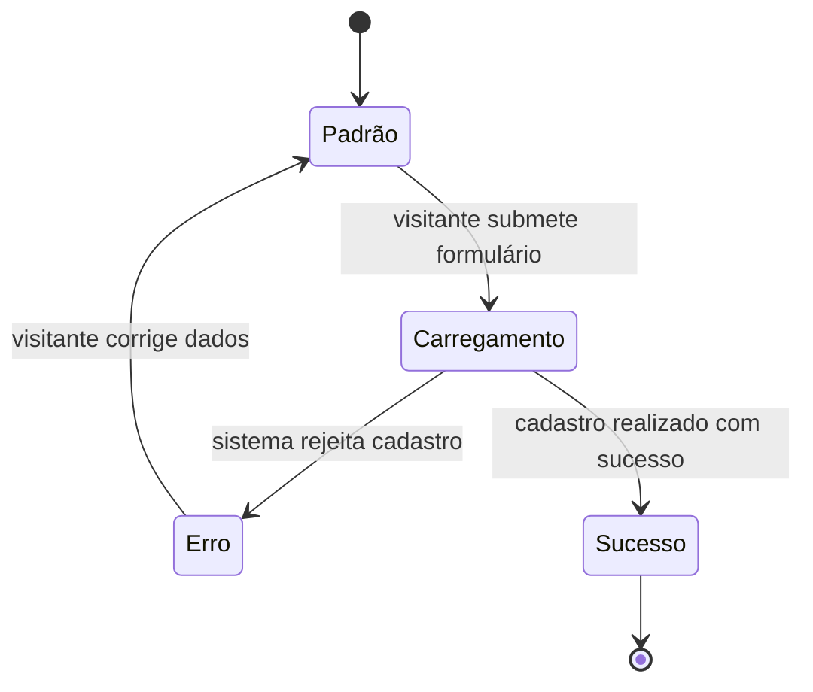

# Exemplo Anotado de `tela.md`

Feature: **Registrar Usuário** | Tela: **Página de Cadastro**

> Este exemplo mostra como cada linha do tela.md é rastreável a um Scenario ou trecho do PRD.
> As anotações em `>` são explicativas — não aparecem no arquivo real.

---

```markdown
# Página de Cadastro
```

> O nome de exibição vem do Scenario:
> `Given que o visitante está na página de cadastro`
> e do PRD (Fluxo Principal: "o visitante acessa a página de cadastro").

---

```markdown
## Visão Geral

- **Nome:** Página de Cadastro
- **Slug:** pagina-de-cadastro
- **URL:** /register
- **Objetivo:** Permitir que um visitante crie uma nova conta informando seus dados pessoais e credenciais de acesso.
- **Scenarios relacionados:**
  - Acessar formulario de cadastro via link na home
  - Cadastro realizado com dados validos
  - Cadastro com dados invalidos no formulario
```

> **Nome:** derivado do `Given` dos Scenarios.
> **Slug:** kebab-case, sem acentos, do nome de exibição.
> **URL:** derivada do PRD (Fluxo Principal) ou de trechos como `/register` nos Scenarios.
> **Objetivo:** orientado ao usuário — o que ele consegue fazer nesta tela.
> **Scenarios relacionados:** títulos exatos do `.feature` que têm `Given` ou `Then` nesta tela.
> O Scenario "Confirmação de conta via link válido" NÃO está listado porque ele ocorre em outra tela (/confirm).

---

```markdown
## Componentes

### Campos de formulário

| Campo | Tipo | Obrigatório | Descrição |
|---|---|---|---|
| Nome | text | Sim | Nome completo do visitante |
| Email | email | Sim | Endereço de email para login e confirmação |
| Senha | password | Sim | Senha de acesso — mínimo 8 caracteres com maiúsculas, minúsculas, números e caracteres especiais |
| Confirmação de senha | password | Sim | Repetição da senha para verificação |
| Data de nascimento | date | Sim | Data de nascimento do visitante |
| Foto de perfil | file | Não | Imagem opcional para avatar do usuário |
```

> Derivado diretamente do `Then` do Scenario "Acessar formulario de cadastro via link na home":
> `Then o sistema exibe um formulário com os campos nome, email, senha, confirmação de senha, data de nascimento e foto de perfil`
>
> Tipo de cada campo inferido do domínio (email → tipo email, senha → tipo password, etc.).
> Obrigatoriedade derivada do Scenario Outline: todos aparecem nas mensagens de erro "campo X é obrigatório",
> exceto foto de perfil que não tem cenário de erro de campo obrigatório.
> A regra de formato da senha é a mensagem literal do Then de erro:
> `"A senha deve ter no mínimo 8 caracteres, incluindo maiúsculas, minúsculas, números e caracteres especiais."`

---

```markdown
### Botões

| Rótulo | Tipo | Comportamento |
|---|---|---|
| Cadastrar | submit | Valida os campos e envia o formulário; em caso de sucesso exibe tela de confirmação de envio de email |
```

> Derivado do `When` do Scenario "Cadastro realizado com dados válidos":
> `When o visitante preenche todos os campos obrigatórios com dados válidos e envia o formulário`
> O rótulo "Cadastrar" é inferido do contexto — se não aparecer explicitamente nos artefatos,
> o agente deve perguntar ao usuário.

---

```markdown
### Links de navegação

| Rótulo | Destino | Contexto |
|---|---|---|
| Link de registro | /register (esta tela) | Apresentado na página inicial; deriva o usuário para esta tela |
```

> Derivado do Scenario "Acessar formulario de cadastro via link na home":
> `When o visitante clica no link de registro`
> `Then o visitante é levado para a página de cadastro`
> Registrado aqui como referência de entrada — o link existe na página inicial, não nesta tela.

---

```markdown
### Conteúdo e mensagens fixas

- Título da página (ex: "Criar conta" ou "Cadastre-se") — a confirmar com design
- Instrução sobre requisitos de senha (derivada da mensagem de erro de senha)
```

> Conteúdo fixo não está nos Scenarios mas é inferível — o agente pode marcar "a confirmar"
> quando não houver âncora explícita nos artefatos.

---

```markdown
## Estados



> O diagrama `stateDiagram-v2` é derivado dos Scenarios: o `When o visitante preenche todos os campos e envia` dispara a transição Padrão→Carregamento. Os `Then` de erro (via Scenario Outline) disparam Carregamento→Erro. O `Then` do caminho feliz dispara Carregamento→Sucesso. O usuário que recebeu erro pode voltar ao Padrão corrigindo os dados.

### Padrão (initial)
Formulário exibido com todos os campos vazios e o botão "Cadastrar" habilitado.
Foto de perfil sem imagem pré-selecionada.

### Carregamento (loading)
Exibido após o visitante submeter o formulário com dados válidos, enquanto o sistema processa o cadastro.
O botão "Cadastrar" fica desabilitado durante o processamento para evitar duplo envio.

### Erro

| Causa | Mensagem exibida |
|---|---|
| Email já associado a uma conta existente | `Este email ja esta cadastrado. Tente fazer login ou use outro endereco.` |
| Senha sem caractere especial | `A senha deve ter no minimo 8 caracteres, incluindo maiusculas, minusculas, numeros e caracteres especiais.` |
| Confirmação de senha diferente da senha informada | `As senhas nao coincidem.` |
| Nome em branco | `O campo nome e obrigatorio.` |
| Data de nascimento em branco | `O campo data de nascimento e obrigatorio.` |
| Email com formato inválido | `Informe um endereco de email valido.` |

### Sucesso
O visitante vê uma tela informando que um link de confirmação foi enviado ao seu email.
O sistema envia um email de confirmação ao endereço informado.
(O visitante é levado para a Página de Confirmação — tela separada.)
```

> **Estado de Erro:** mensagens copiadas literalmente da coluna `mensagem_de_erro` do `Scenario Outline`.
> Não foram parafraseadas nem corrigidas — texto exato como aparece no `.feature`.
>
> **Estado de Sucesso:** derivado do `Then` do Scenario "Cadastro realizado com dados válidos":
> `Then o visitante vê uma tela informando que um link de confirmação foi enviado ao seu email`
> `And o sistema envia um email de confirmação ao endereço informado`
>
> **Estado de Carregamento:** não explícito nos Scenarios, mas inferível da operação assíncrona
> de envio de formulário. O agente fez UMA pergunta ao usuário para confirmar.

---

```markdown
## Considerações

### Validações
- **Email:** formato válido de endereço de email; não pode estar já cadastrado no sistema
- **Senha:** mínimo 8 caracteres, incluindo letras maiúsculas, minúsculas, números e caracteres especiais
- **Confirmação de senha:** deve ser idêntica ao campo senha
- **Nome:** campo obrigatório; não pode estar em branco
- **Data de nascimento:** campo obrigatório; não pode estar em branco

### Acessibilidade
Não especificado nos artefatos atuais. A preencher quando houver requisito não funcional correspondente.

### Responsividade
Não especificado nos artefatos atuais. A preencher quando houver requisito não funcional correspondente.
```

> **Validações:** derivadas do `Scenario Outline` + `Examples` — cada linha da tabela de erros
> implica uma regra de validação.
>
> **Acessibilidade e Responsividade:** não mencionadas nos artefatos disponíveis.
> O agente registra "a preencher" em vez de inventar — rastreabilidade é obrigatória.

---

```markdown
## Referências Visuais

### Wireframe
_A preencher manualmente._

### Mockup
_A preencher manualmente._

### Protótipo interativo
_A preencher manualmente._
```

> Esta seção é **sempre** deixada com os 3 placeholders padrão.
> O agente `extract-views-agent` nunca preenche esta seção.
> A equipe de design preenche manualmente com links para Figma, imagens ou protótipos.
