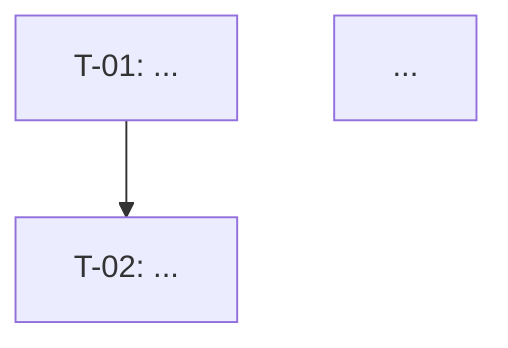

# Formato: Tasks de Implementação

> Este arquivo define o formato de saída esperado para o artefato `tasks.md`.
> Edite este arquivo para adaptar o formato ao seu projeto ou empresa.

---

## Estrutura do arquivo

```markdown
# Tasks — <Nome da Feature>

## REQ-1 — <Título do Requisito>

> <Texto completo do requisito>

### T-01: <Título da task>
- [ ] <descrição>
**Rastreabilidade:** ...
**Depende de:** ...
**Concluída quando:** ...

---

## REQ-2 — <Título do Requisito>
...

## NFRs sem REQ direto   ← apenas se houver NFRs não cobertos acima
...

## Grafo de Dependências   ← derivado automaticamente dos campos "Depende de"


```

---

## Formato de cada task

```markdown
### T-<NN>: <Título imperativo e específico>

- [ ] <O que deve ser feito, em 1-3 frases. Sem código. Sem genericidade.>

**Rastreabilidade:** <REQ-N> · <NFR-N> · <Scenario: "nome exato">
**Depende de:** <T-NN, T-NN> ou `—`
**Concluída quando:** <Uma frase verificável por qualquer membro do time.>
```

### Campos obrigatórios

| Campo | Regra |
|-------|-------|
| ID | Sequencial global: T-01, T-02... (não reinicia por bloco) |
| Título | Imperativo, específico. Começa com verbo: "Implementar", "Criar", "Configurar", "Cobrir" |
| Descrição | 1-3 frases. Sem código. |
| Rastreabilidade | Ao menos um REQ ou NFR. Adiciona Scenario quando é task de teste. |
| Depende de | IDs bloqueantes, ou `—`. |
| Concluída quando | Critério verificável. Não "quando estiver pronto". |

---

## Checklist por tipo de task

**Modelo / dados:**
- [ ] Uma task por entidade nova + uma task de migration separada
- [ ] Uma task por schema de validação de payload (ex: Zod)

**Domínio:**
- [ ] Uma task por método de domínio
- [ ] Descrição sem banco, HTTP ou serviço externo

**Infraestrutura:**
- [ ] Uma task por método de repository (save, findValid e markAsUsed = 3 tasks)
- [ ] Uma task por adapter de serviço externo
- [ ] Cada NFR de `nf-requirements.md` coberto por ao menos uma task

**API:**
- [ ] Uma task por endpoint (path importa)
- [ ] Uma task por handler de erro relevante
- [ ] Tasks de API dependem das tasks de infraestrutura que usam

**Testes:**
- [ ] Uma task por Scenario do `.feature`
- [ ] Uma task por NFR com critério mensurável
- [ ] Tasks de teste E2E dependem do endpoint testado
- [ ] **Nenhuma task de teste é dependência de task de implementação**

**UI (apenas quando `docs/design-system/` existir):**
- [ ] Componentes de UI referenciam o componente de design system a reutilizar
- [ ] Tokens de design referenciados na descrição (não valores literais)

---

## Regra de agrupamento

- Cada task fica no bloco do REQ que ela endereça **primariamente**.
- Task usada por múltiplos REQs → bloco do REQ de menor numeração.
- NFRs → bloco do REQ relacionado; sem REQ direto → bloco próprio ao final.

---

## Cobertura mínima obrigatória

- [ ] Cada REQ tem bloco próprio com ao menos 1 task
- [ ] Cada NFR coberto por ao menos 1 task
- [ ] Cada Scenario tem ao menos 1 task de teste
- [ ] Cada componente novo do `design.md` tem ao menos 1 task
- [ ] Cada endpoint tem ao menos 1 task de implementação e 1 task de teste
- [ ] Grafo de dependências `flowchart TD` presente ao final
